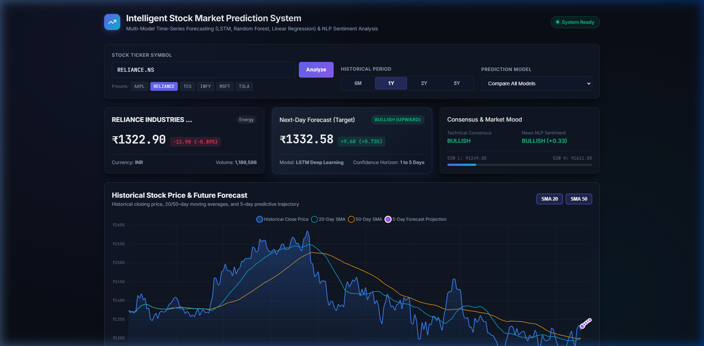
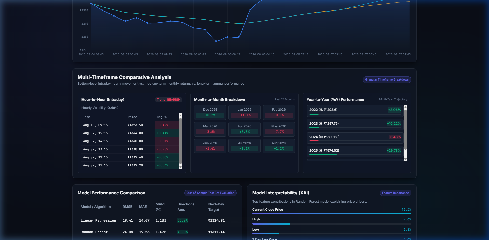
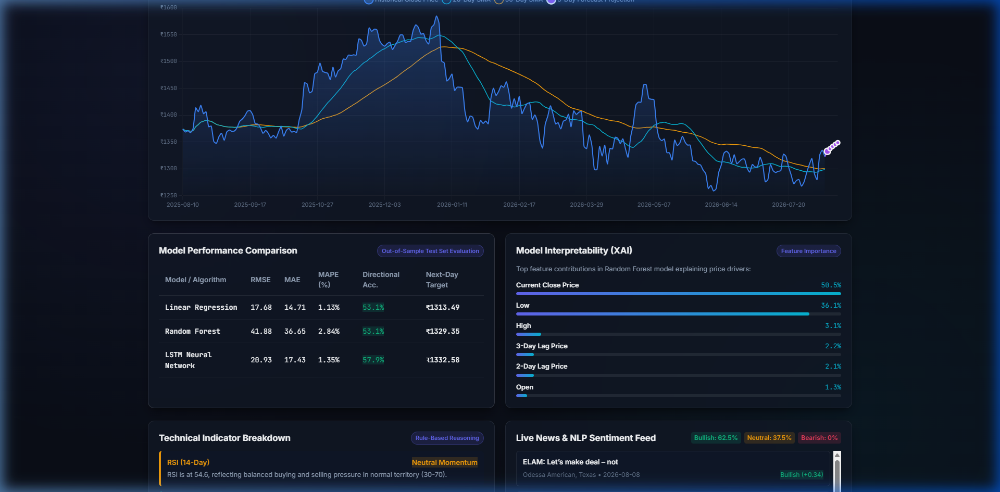

# Intelligent Stock Market Prediction System

A full-stack financial analytics and multi-model stock price forecasting platform built with Python, PyTorch, Scikit-Learn, and Flask. The platform integrates real-time market data ingestion via `yfinance`, multi-timeframe comparative analytics (hourly intraday, monthly seasonality, and annual performance), technical indicator feature engineering (SMA, EMA, RSI, MACD, Volatility), news sentiment analysis via NLP, and explainable AI (XAI) feature importance rankings.

---

## 📸 Dashboard Previews

### 1. Market Overview & Forecast Projection


### 2. Multi-Timeframe Comparative Analysis (Hourly, Monthly & YoY)


### 3. Multi-Model Performance Benchmarking & Explainable AI (XAI)


---

## 🚀 Key Features

- **Multi-Asset Market Data Ingestion**:
  - Real-time and historical price ingestion (Open, High, Low, Close, Volume) for Indian equities (NSE: `RELIANCE.NS`, `TCS.NS`, `INFY.NS`, etc.) and US equities (`AAPL`, `MSFT`, `TSLA`, `NVDA`, `GOOGL`).
- **Multi-Timeframe Comparative Analytics**:
  - **Bottom-Level (Intraday Hourly)**: Real-time 1-hour candle tracking, intraday volatility measurement, and hourly trend direction.
  - **Mid-Level (Month-to-Month)**: Trailing 12-month return breakdown to identify cyclical seasonality.
  - **High-Level (Year-to-Year)**: Multi-year annual CAGR, high/low price boundaries, and long-term macro trend trajectory.
- **Technical Indicator Engineering**:
  - **Trend**: 20-Period Moving Average (`SMA_20`), 50-Period Moving Average (`SMA_50`), 20-Period Exponential Moving Average (`EMA_20`).
  - **Momentum**: 14-Period Relative Strength Index (`RSI_14`), Moving Average Convergence Divergence (`MACD` & Signal Line).
  - **Volatility & Price Dynamics**: 20-Period Return Volatility, Daily Returns %, and Multi-Day Price Lags.
- **Benchmarked Multi-Model Forecasting Pipeline**:
  - **PyTorch LSTM Recurrent Neural Network**: 2-layer LSTM deep neural network with 60-day sliding window lookback sequences for sequential temporal pattern recognition.
  - **Random Forest Regressor**: Non-linear ensemble model with Mean Decrease in Impurity (MDI) feature importance extraction.
  - **Linear Regression Baseline**: Fast, interpretable statistical benchmark.
- **NLP News Sentiment Engine**:
  - Live ticker news headline extraction with financial sentiment lexicon polarity scoring (-1.0 to +1.0) and negation handling.
- **Explainable AI (XAI) & Interpretability**:
  - Feature contribution weight visualization and plain-English technical indicator signal decomposition.
- **Interactive Dark-Mode Web Dashboard**:
  - Responsive glassmorphism interface built with Vanilla HTML5, CSS3, JavaScript, and Chart.js.

---

## 🏗️ System Architecture

```
Stock/
├── backend/
│   ├── app.py                 # Flask REST API & static dashboard server
│   ├── data_fetcher.py        # Market data ingestion & multi-timeframe analytics
│   ├── preprocessor.py        # Technical feature engineering & 60-day sequence generation
│   ├── sentiment.py           # Real-time news sentiment analysis
│   ├── utils.py               # Time-series evaluation metrics (RMSE, MAE, MAPE, Dir. Accuracy)
│   └── models/
│       ├── linear_model.py    # Baseline Linear Regression model
│       ├── rf_model.py        # Random Forest Regressor with feature importance extraction
│       └── lstm_model.py      # PyTorch LSTM deep neural network
├── frontend/
│   ├── index.html             # Financial analytics dashboard UI
│   ├── css/
│   │   └── style.css          # Dark-mode glassmorphism custom design system
│   └── js/
│       └── app.js             # Chart.js visualization, model controls & live API binding
├── screenshots/               # Application preview assets
├── requirements.txt           # Project dependencies
└── README.md
```

---

## 🧠 Machine Learning & Deep Learning Pipeline

### 1. Sliding Window Sequence Formulation
For time-series sequential learning with LSTM, closing prices are scaled to $[0, 1]$ using `MinMaxScaler`:

$$x_{\text{scaled}} = \frac{x - x_{\min}}{x_{\max} - x_{\min}}$$

A sliding lookback window of length $T = 60$ trading days creates the sequential input tensors:

$$X_i = [p_{i-59}, p_{i-58}, \dots, p_i], \quad y_i = p_{i+1}$$

### 2. PyTorch LSTM Architecture
- **Input Dimension**: 1 (Normalized sequential price series)
- **Hidden Dimension**: 64 units
- **Layers**: 2 stacked LSTM recurrent layers with Dropout ($p = 0.2$)
- **Output Layer**: Linear projection layer ($64 \to 1$)
- **Loss Function**: Mean Squared Error ($\text{MSE}$)
- **Optimizer**: Adam ($\text{lr} = 0.005$)

### 3. Evaluation Metrics
Evaluated on out-of-sample chronological test splits:
- **Root Mean Squared Error (RMSE)**: $\sqrt{\frac{1}{N}\sum_{i=1}^N (y_i - \hat{y}_i)^2}$
- **Mean Absolute Error (MAE)**: $\frac{1}{N}\sum_{i=1}^N |y_i - \hat{y}_i|$
- **Mean Absolute Percentage Error (MAPE)**: $\frac{100\%}{N}\sum_{i=1}^N \left|\frac{y_i - \hat{y}_i}{y_i}\right|$
- **Directional Accuracy (%)**: $\frac{1}{N-1}\sum_{i=2}^N \mathbb{I}\left(\text{sign}(y_i - y_{i-1}) == \text{sign}(\hat{y}_i - y_{i-1})\right) \times 100\%$

---

## 🔌 API Endpoints

| Method | Endpoint | Description |
| :--- | :--- | :--- |
| `GET` | `/api/stock/info?ticker=<symbol>` | Company metadata, sector, currency, market cap, and 52-week statistics |
| `GET` | `/api/stock/history?ticker=<symbol>&period=<period>&interval=<interval>` | Historical OHLCV data with computed technical indicators |
| `GET` | `/api/stock/timeframe-analysis?ticker=<symbol>` | Multi-timeframe statistics (hourly intraday, monthly returns, YoY performance) |
| `POST` | `/api/stock/predict` | Model training, out-of-sample metrics, next-day target, and 5-day forecast |
| `GET` | `/api/stock/sentiment?ticker=<symbol>` | Recent news headline sentiment scoring and market mood classification |
| `GET` | `/api/stock/explain?ticker=<symbol>` | Feature importance weights and rule-based technical signal explanations |

---

## ⚙️ Running Locally

### 1. Clone the Repository
```bash
git clone https://github.com/your-username/stock-market-prediction.git
cd stock-market-prediction
```

### 2. Install Dependencies
```bash
pip install -r requirements.txt
```

### 3. Start the Application
```bash
python backend/app.py
```

Navigate to **`http://localhost:5000`** in your browser.
